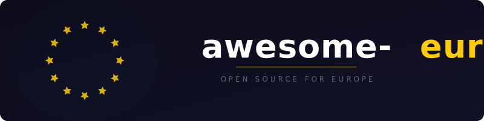

  
    
  
    
  
A curated list of open source software that provides support specifically for Europe — its institutions, regulations, standards, and cross-border infrastructure.

## Contents

<!--lint disable awesome-list-item-->

- [GDPR and Data Protection](#gdpr-and-data-protection)
- [eIDAS and Digital Identity](#eidas-and-digital-identity)
- [Interoperability and Digital Infrastructure](#interoperability-and-digital-infrastructure)
- [Electronic Invoicing](#electronic-invoicing)
- [Payments and Banking](#payments-and-banking)
- [Central Banking and Monetary Policy](#central-banking-and-monetary-policy)
- [VAT, Customs, and Trade](#vat-customs-and-trade)
- [Anti-Money Laundering and Compliance](#anti-money-laundering-and-compliance)
- [Finance and Capital Markets](#finance-and-capital-markets)
- [Open Data and Statistics](#open-data-and-statistics)
- [Legal and Legislation](#legal-and-legislation)
- [Democracy and Governance](#democracy-and-governance)
- [Public Procurement](#public-procurement)
- [Energy and Electricity](#energy-and-electricity)
- [Sustainability and ESG](#sustainability-and-esg)
- [Transport and Mobility](#transport-and-mobility)
- [Geospatial and Earth Observation](#geospatial-and-earth-observation)
- [Health and Pharmaceuticals](#health-and-pharmaceuticals)
- [Cybersecurity](#cybersecurity)
- [Digital Services and Platforms](#digital-services-and-platforms)
- [Education and Research](#education-and-research)
- [European Utilities](#european-utilities)
- [Country-Specific Awesome Lists](#country-specific-awesome-lists)

<!--lint enable awesome-list-item-->

## GDPR and Data Protection

EU General Data Protection Regulation (2016/679) and related data protection frameworks.

- [Cookie Consent](https://github.com/orestbida/cookieconsent) - Simple cross-browser cookie-consent plugin written in vanilla JavaScript for GDPR and ePrivacy compliance.
- [Consent-O-Matic](https://github.com/cavi-au/Consent-O-Matic) - Browser extension that automatically fills out cookie popups based on your preferences.
- [Klaro](https://github.com/kiprotect/klaro) - Privacy-friendly and compliant consent manager for websites.
- [GDPR Transparency and Consent Framework](https://github.com/InteractiveAdvertisingBureau/GDPR-Transparency-and-Consent-Framework) - Technical specifications for IAB Europe Transparency and Consent Framework for GDPR compliance in digital advertising.
- [GDPR Checklist](https://github.com/privacyradius/gdpr-checklist) - Checklist for GDPR compliance.
- [CISO Assistant](https://github.com/intuitem/ciso-assistant-community) - GRC platform supporting 100+ frameworks including GDPR, NIS2, DORA, and ISO 27001 with automatic control mapping.
- [Probo](https://github.com/getprobo/probo) - Open source compliance solutions for SOC2, GDPR, and ISO 27001.

## eIDAS and Digital Identity

Electronic Identification, Authentication and Trust Services regulation for cross-border digital identity, including the EU Digital Identity Wallet.

- [EUDI Architecture and Reference Framework](https://github.com/eu-digital-identity-wallet/eudi-doc-architecture-and-reference-framework) - Architecture and reference framework for the European Digital Identity Wallet.
- [EUDI Wallet Android](https://github.com/eu-digital-identity-wallet/eudi-app-android-wallet-ui) - EUDI Wallet prototype for Android.
- [EUDI Wallet iOS](https://github.com/eu-digital-identity-wallet/eudi-app-ios-wallet-ui) - EUDI Wallet prototype for iOS.
- [EUDI Verifier Endpoint](https://github.com/eu-digital-identity-wallet/eudi-srv-verifier-endpoint) - Web application that acts as a Verifier trusted endpoint for the EUDI Wallet.
- [walt.id Identity](https://github.com/walt-id/waltid-identity) - All-in-one open source identity and wallet toolkit with eIDAS 2.0 support.
- [Procivis One Core](https://github.com/procivis/one-core) - Issue, hold and verify digital identities and credentials with eIDAS 2.0 compliancy.
- [Procivis One Wallet](https://github.com/procivis/one-wallet) - Digital wallet with eIDAS 2.0 compliancy, ISO 18013-5 mdocs, and SD-JWT VC support.
- [eIDAS Middleware](https://github.com/Governikus/eidas-middleware) - Implementation of the European eIDAS middleware provided under the EUPL 1.2 by Governikus.
- [eIDAS Keycloak Extension](https://github.com/grnet/eidas-keycloak-extension) - Keycloak Identity Provider extension supporting the eIDAS SAML v2.0 dialect.
- [Apple eIDAS](https://github.com/apple/eidas) - Tools for reading and creating eIDAS certificate signing requests.
- [pyMDOC-CBOR](https://github.com/IdentityPython/pyMDOC-CBOR) - MDOC CBOR static Verifier and Issuer for EUDI Wallet PID and mDL use cases.
- [tl-create](https://github.com/PeculiarVentures/tl-create) - Cross-platform CLI tool to create X.509 trust lists from various trust stores including eIDAS.
- [SSI Agent](https://github.com/impierce/ssi-agent) - eIDAS 2.0-compliant Self Sovereign Identity Agent that connects European Identity Wallets to IT systems.
- [Open Banking eIDAS Broker](https://github.com/enablebanking/open_banking_eidas_broker) - Microservice using eIDAS certificates for signing PSD2 API requests and accessing banks over mTLS.
- [js-undersign](https://github.com/moll/js-undersign) - JavaScript library for creating eIDAS compatible XAdES signatures with support for OCSP and timestamps.

## Interoperability and Digital Infrastructure

CEF building blocks (eDelivery, eSignature, eTranslation), X-Road, EBSI, and EU cross-border digital infrastructure.

- [DSS](https://github.com/esig/dss) - EU Digital Signature Service for creation, extension and validation of advanced electronic signatures (CAdES, XAdES, PAdES, ASiC).
- [X-Road](https://github.com/nordic-institute/X-Road) - Data exchange layer software used by EU member states for secure cross-border data exchange.
- [Eclipse Dataspace Connector](https://github.com/eclipse-edc/Connector) - EDC core services including data plane and control plane for EU data spaces.
- [FIWARE Catalogue](https://github.com/FIWARE/catalogue) - Curated framework of open source platform components for EU smart applications using NGSI-LD.
- [Europa Component Library](https://github.com/ec-europa/europa-component-library) - Component library used by the European Commission websites.
- [sovity EDC CE](https://github.com/sovity/edc-ce) - Community Edition of the Eclipse Dataspace Connector by sovity.
- [Orion-LD](https://github.com/FIWARE/context.Orion-LD) - Context Broker and CEF building block for context data management supporting NGSI-LD and NGSI-v2.
- [FIWARE NGSI-LD Tutorials](https://github.com/FIWARE/tutorials.NGSI-LD) - Step-by-step tutorials for FIWARE NGSI-LD smart applications.
- [pkilint](https://github.com/digicert/pkilint) - Framework for verifying PKI structures including EU trust service certificates.
- [Smart Data Models](https://github.com/smart-data-models/data-models) - Harmonized data models for EU-funded smart applications based on NGSI-LD.
- [Europeana Portal](https://github.com/europeana/portal.js) - Europeana.eu website providing access to European cultural heritage collections.
- [Europeana Core Library](https://github.com/europeana/corelib) - Core library containing EDM (Europeana Data Model) used by Europeana applications.
- [LinkedPipes ETL](https://github.com/linkedpipes/etl) - RDF-based lightweight ETL tool developed under EU research funding.

## Electronic Invoicing

Peppol, EN 16931, and the EU e-invoicing directive (2014/55/EU) for cross-border electronic invoicing.

- [ZUGFeRD/XRechnung Library](https://github.com/horstoeko/zugferd) - PHP library for ZUGFeRD, XRechnung, and Factur-X e-invoicing formats.
- [Factur-X](https://github.com/akretion/factur-x) - Python library for Factur-X, the e-invoicing standard for France and Germany based on EN 16931.
- [phase4](https://github.com/phax/phase4) - AS4 client and server with built-in support for Peppol and CEF eDelivery.
- [phoss SMP](https://github.com/phax/phoss-smp) - Peppol and OASIS BDXR SMP Server, CEF eDelivery compliant.
- [einvoicing (PHP)](https://github.com/josemmo/einvoicing) - PHP library for reading and creating European-compliant electronic invoices (EN 16931).
- [OpenXRechnungToolbox](https://github.com/jcthiele/OpenXRechnungToolbox) - GUI for visualization and validation of XRechnung and other EN 16931-compliant e-invoices.
- [Oxalis](https://github.com/OxalisCommunity/oxalis) - PEPPOL Access Point open source implementation.
- [Oxalis-NG](https://github.com/OxalisCommunity/oxalis-ng) - Open source implementation of OpenPeppol AS4 profile (next generation).
- [Peppol BIS Invoice 3](https://github.com/OpenPEPPOL/peppol-bis-invoice-3) - Official Peppol BIS 3.0 billing specifications.
- [UBL Invoice](https://github.com/num-num/ubl-invoice) - PHP library to read and create valid UBL and Peppol BIS files.
- [phive](https://github.com/phax/phive) - Generic business document validation engine for EU e-invoicing standards.
- [phive-rules](https://github.com/phax/phive-rules) - Preconfigured validation rules for Peppol, XRechnung, and other EU e-invoicing formats.
- [Peppol Commons](https://github.com/phax/peppol-commons) - Java library with shared Peppol components including identifier handling and SMP/SML clients.
- [phoss Directory](https://github.com/phax/phoss-directory) - Official Peppol Directory software.
- [Recommand Peppol](https://github.com/brbxai/recommand-peppol) - Open source Peppol API.
- [einvoicing (JS)](https://github.com/esvit/einvoicing) - JavaScript library for creating and parsing electronic invoices compliant with the eInvoicing Directive and EN 16931.
- [e-invoicing (PHP)](https://github.com/easybill/e-invoicing) - PHP library to generate and read EN 16931 structured XML with UBL and CII syntaxes.

## Payments and Banking

SEPA, PSD2, Open Banking, EBICS, and the Single Euro Payments Area infrastructure.

- [Open Banking Gateway](https://github.com/adorsys/open-banking-gateway) - RESTful API, tools, adapters, and connectors for transparent access to open banking APIs (PSD2).
- [XS2A](https://github.com/adorsys/xs2a) - Open source NextGenPSD2 XS2A implementation for PSD2 compliance.
- [Nordigen Python](https://github.com/nordigen/nordigen-python) - Python library for the Nordigen open banking API.
- [Sephpa](https://github.com/AbcAeffchen/Sephpa) - PHP class to create SEPA XML files for credit transfer and direct debit.
- [SepaUtilities](https://github.com/AbcAeffchen/SepaUtilities) - PHP methods for validating and sanitizing inputs used in SEPA files.

## Central Banking and Monetary Policy

ECB APIs, TARGET2/T2S/TIPS, Euribor/ESTR, euro exchange rates, and Eurosystem tools.

- [Swap](https://github.com/florianv/swap) - Currency exchange rates library supporting ECB and other European central bank providers.
- [Frankfurter](https://github.com/lineofflight/frankfurter) - Currency data API built on top of ECB exchange rates.

## VAT, Customs, and Trade

EU VAT system (VIES, OSS/IOSS), TARIC customs tariffs, CN codes, EORI, and Intrastat.

- [ibericode VAT](https://github.com/ibericode/vat) - PHP library for dealing with European VAT including rates and VIES validation.
- [node-sales-tax](https://github.com/valeriansaliou/node-sales-tax) - International sales tax calculator for Node.js with EU VAT support including VIES validation.
- [VIES](https://github.com/DragonBe/vies) - PHP component for the European Commission VAT Information Exchange System (VIES).
- [vat](https://github.com/dannyvankooten/vat) - Go package for EU VAT number validation and rates retrieval.

## Anti-Money Laundering and Compliance

EU Anti-Money Laundering Directives (AMLD), sanctions screening, KYC/KYB, beneficial ownership, and LEI tools.

- [Aleph](https://github.com/alephdata/aleph) - Search and browse documents and data to find people and companies, used for investigative journalism and EU compliance.
- [OpenSanctions](https://github.com/opensanctions/opensanctions) - Open database of international sanctions data, persons of interest and politically exposed persons, including EU sanctions lists.
- [Follow the Money](https://github.com/alephdata/followthemoney) - Data model and processing tools for investigative entity data used in EU AML compliance.

## Finance and Capital Markets

EBA, ESMA regulations, MiFID II, MiCA, DORA, EMIR, XBRL/iXBRL reporting, and European financial market infrastructure.

- [Arelle](https://github.com/Arelle/Arelle) - Open source XBRL platform for European financial reporting including EBA and ESMA taxonomies.

## Open Data and Statistics

Eurostat, EU Open Data Portal, SDMX, NUTS regions, and pan-European statistical infrastructure.

- [eurostat (R)](https://github.com/rOpenGov/eurostat) - R tools for Eurostat open data access and analysis.
- [Nuts2json](https://github.com/eurostat/Nuts2json) - Eurostat NUTS regions dataset as JSON for web mapping.
- [SDMX-ML](https://github.com/sdmx-twg/sdmx-ml) - Format specification for statistical data exchange used by Eurostat and ECB.
- [Open Data Handbook](https://github.com/okfn/opendatahandbook) - Guide to legal, social and technical aspects of open data, widely used in EU open data initiatives.
- [Metis Framework](https://github.com/europeana/metis-framework) - Data publication framework for ingesting and processing European cultural heritage metadata.

## Legal and Legislation

EUR-Lex, ECLI, CELEX, ELI, Akoma Ntoso, and tools for accessing and processing European legislation.

- [eForms SDK](https://github.com/OP-TED/eForms-SDK) - eForms notification standard for public procurement procedures in the EU, published by the EU Publications Office.
- [eForms Notice Viewer](https://github.com/OP-TED/eforms-notice-viewer) - Sample application that can visualise an eForms notice using the eForms SDK.

## Democracy and Governance

European Parliament, EU elections, Transparency Register, European Citizens' Initiative, and EU legislative tracking.

- [Parltrack](https://github.com/parltrack/parltrack) - Parliamentary tracker application for monitoring the European Parliament.
- [EveryPolitician Data](https://github.com/everypolitician/everypolitician-data) - Data for national legislatures worldwide including all EU member states.
- [FragDenStaat](https://github.com/okfde/fragdenstaat_de) - Freedom of information portal for government transparency requests.

## Public Procurement

TED (Tenders Electronic Daily), eForms, ESPD, CPV codes, and EU public procurement infrastructure.

- [OCDS Standard](https://github.com/open-contracting/standard) - Open Contracting Data Standard used in EU public procurement transparency.

## Energy and Electricity

ENTSO-E Transparency Platform, ACER, REMIT, and the European energy market.

- [entsoe-py](https://github.com/EnergieID/entsoe-py) - Python client for the ENTSO-E API (European Network of Transmission System Operators for Electricity).
- [PyPSA-Eur](https://github.com/PyPSA/pypsa-eur) - Open optimisation model of the European energy system covering electricity, heating, and transport sectors.
- [atlite](https://github.com/PyPSA/atlite) - Python package for calculating renewable power potentials and time series for the European energy system.
- [powerplantmatching](https://github.com/PyPSA/powerplantmatching) - Tools to combine multiple European power plant databases.
- [technology-data](https://github.com/PyPSA/technology-data) - Compiled assumptions on European energy system technologies including costs and efficiencies.
- [Open Smart Grid Platform](https://github.com/OSGP/open-smart-grid-platform) - Open source platform for smart grid management in European energy networks.

## Sustainability and ESG

EU Taxonomy, CSRD, SFDR, CBAM, Digital Product Passport, EU Deforestation Regulation, and sustainable finance.

- [Eclipse Tractus-X](https://github.com/eclipse-tractusx/tractus-x-release) - EU-funded Catena-X automotive data ecosystem for supply chain transparency and sustainability.

## Transport and Mobility

European railway interoperability (ERA, ETCS), cross-border transport, eCall, EETS, and EU mobility frameworks.

- [Pumperly](https://github.com/GeiserX/pumperly) - Open source fuel and EV route planner with real-time prices across European countries.
- [OSRD](https://github.com/OpenRailAssociation/osrd) - Open source web application for railway infrastructure design, capacity analysis, and timetabling across European networks.
- [Eclipse SUMO](https://github.com/eclipse-sumo/sumo) - Open source, highly portable microscopic traffic simulation package used in EU transport research.
- [UIC Barcode](https://github.com/UnionInternationalCheminsdeFer/UIC-barcode) - Implementation of the FCB barcode standard (IRS 90918-9) for European railway ticketing.
- [Digitransit UI](https://github.com/HSLdevcom/digitransit-ui) - Open source multi-modal journey planner UI used in European public transport.

## Geospatial and Earth Observation

INSPIRE directive, Copernicus programme, Sentinel data, and European geospatial infrastructure.

- [eo-learn](https://github.com/sentinel-hub/eo-learn) - Earth observation processing framework for machine learning using Copernicus Sentinel data.
- [sentinelhub-py](https://github.com/sentinel-hub/sentinelhub-py) - Python library to download and process satellite imagery using Sentinel Hub services.
- [pygeoapi](https://github.com/geopython/pygeoapi) - Python server implementation of the OGC API suite of standards used in INSPIRE infrastructure.
- [OWSLib](https://github.com/geopython/OWSLib) - Python package for client programming with OGC web services used in European geospatial infrastructure.
- [CDS API](https://github.com/ecmwf/cdsapi) - Python API to access the Copernicus Climate Data Store.
- [cfgrib](https://github.com/ecmwf/cfgrib) - Python interface to map GRIB files to NetCDF, widely used with Copernicus weather data.
- [eccodes](https://github.com/ecmwf/eccodes) - ECMWF library for GRIB and BUFR decoding and encoding used in European weather and climate services.
- [CliMetLab](https://github.com/ecmwf/climetlab) - Python package for easy access to Copernicus weather and climate data.
- [Atlas](https://github.com/ecmwf/atlas) - ECMWF library for numerical weather prediction and climate modelling.
- [OpenSarToolkit](https://github.com/ESA-PhiLab/OpenSarToolkit) - ESA toolkit for inventory, download and pre-processing of Sentinel-1 SAR data.
- [LISFLOOD](https://github.com/ec-jrc/lisflood-code) - JRC spatially distributed water resources model used for European flood forecasting.
- [c2cgeoportal](https://github.com/camptocamp/c2cgeoportal) - Geoportal application framework used in European INSPIRE-compliant geospatial portals.

## Health and Pharmaceuticals

European Health Data Space (EHDS), EMA, EudraVigilance, EHIC, EU MDR/IVDR, and cross-border healthcare.

- [HL7 EU Laboratory](https://github.com/hl7-eu/laboratory) - HL7 Europe Laboratory Report FHIR Implementation Guide.
- [HL7 EU Base](https://github.com/hl7-eu/base) - Base profiles and common artefacts for HL7 FHIR in Europe.
- [EGA Download Client](https://github.com/EGA-archive/ega-download-client) - Python client for the European Genome-phenome Archive.

## Cybersecurity

NIS2 directive, ENISA, EU Cybersecurity Act, Cyber Resilience Act, and European cyber frameworks.

- [ALTCHA](https://github.com/altcha-org/altcha) - GDPR and EAA compliant, self-hosted CAPTCHA alternative with proof-of-work mechanism.

## Digital Services and Platforms

Digital Services Act (DSA), Digital Markets Act (DMA), EU Data Act, and platform regulation tools.

## Education and Research

ECTS, Erasmus+, Horizon Europe, CORDIS, OpenAIRE, EOSC, CERN, and European research infrastructure.

- [CERN Open Data Portal](https://github.com/cernopendata/opendata.cern.ch) - Source code for the CERN Open Data portal providing access to particle physics research data.
- [OpenAPC](https://github.com/OpenAPC/openapc-de) - Collect and disseminate information on fee-based Open Access publishing in European research.
- [ELIXIR RDMkit](https://github.com/elixir-europe/rdmkit) - ELIXIR European Research Data Management Toolkit.
- [CSV Validator](https://github.com/digital-preservation/csv-validator) - CSV Validation Tool and API used in European digital preservation projects.

## European Utilities

Pan-European utility libraries: IBAN validation, NUTS regions, European phone numbers, postal codes, holidays, and locale tools.

- [php-iban](https://github.com/globalcitizen/php-iban) - PHP library to generate, parse, validate, error-correct and present IBAN bank account numbers.
- [iban-validation](https://github.com/jschaedl/iban-validation) - PHP library for validating International Bank Account Numbers (IBANs) used in SEPA.

## Country-Specific Awesome Lists

Awesome lists focused on individual European countries.

- [awesome-spain](https://github.com/GeiserX/awesome-spain) - Open source software for Spain.

## Contributing

Contributions are welcome. Read the [contributing guidelines](contributing.md) before submitting a pull request.

**Note:** This list focuses on open source software that provides **support specifically for Europe** — its institutions, regulations, standards, and cross-border infrastructure. The scope covers the **EU-27 and EEA** (Norway, Iceland, Liechtenstein). Software specific to a single country belongs in country-specific awesome lists. Software that is global and merely happens to work in Europe is also out of scope.

**Disclaimer:** No projects related to pornography, NSFW content, gambling, religion, partisan politics, or any other controversial topic are accepted. This list aims to be a neutral and useful technical resource for the developer community.
