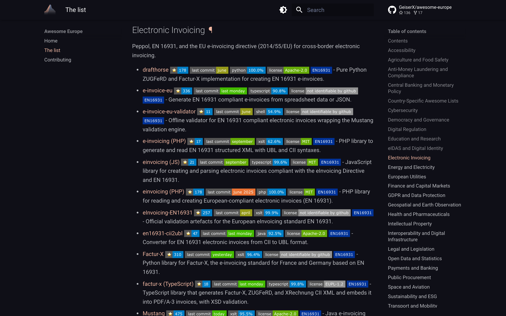

---
hide:
  - navigation
---

# Awesome Europe { .ae-visually-hidden }

  

  
  
  
  

---

**Awesome Europe** is a curated list of open source software built for Europe: its institutions, regulations, standards and cross-border infrastructure. Over 500 projects in 27 categories, each tagged with the EU regulation, institution or standard it supports, for developers who have to send a Peppol invoice, accept an eIDAS signature, validate a VAT number or pull Eurostat data. [Browse the list](list.md) or [suggest a project](contributing.md).

-   :material-format-list-bulleted: **[Browse the list](list.md)**

    ---

    Every project on one page, by category, with the regulation it supports and a one-line description.

-   :material-magnify: **[Search by regulation](list.md?q=Peppol)**

    ---

    Type Peppol, VIES, eIDAS, EN 301 549 or a language into the search box. Results open on the category.

-   :material-source-pull: **[Suggest a project](contributing.md)**

    ---

    The inclusion rules, the entry format and the pull request steps.

-   :material-shield-check: **[Add the listed-on badge](list.md#badge-for-listed-projects)**

    ---

    Four badge styles for the README of a project that is on the list.

## What an entry looks like

Every entry is one line: the project, four live badges (stars, last commit, main language, license), one or more blue tags that link to the official page of the regulation or institution, an optional link to a public demo, and a one-sentence description.

## What is in the list

27 categories, each a section of the list page:

- [Accessibility](list.md#accessibility)
- [Agriculture and Food Safety](list.md#agriculture-and-food-safety)
- [Anti-Money Laundering and Compliance](list.md#anti-money-laundering-and-compliance)
- [Central Banking and Monetary Policy](list.md#central-banking-and-monetary-policy)
- [Country-Specific Awesome Lists](list.md#country-specific-awesome-lists)
- [Cybersecurity](list.md#cybersecurity)
- [Democracy and Governance](list.md#democracy-and-governance)
- [Digital Regulation](list.md#digital-regulation)
- [Education and Research](list.md#education-and-research)
- [eIDAS and Digital Identity](list.md#eidas-and-digital-identity)
- [Electronic Invoicing](list.md#electronic-invoicing)
- [Energy and Electricity](list.md#energy-and-electricity)
- [European Utilities](list.md#european-utilities)
- [Finance and Capital Markets](list.md#finance-and-capital-markets)

- [GDPR and Data Protection](list.md#gdpr-and-data-protection)
- [Geospatial and Earth Observation](list.md#geospatial-and-earth-observation)
- [Health and Pharmaceuticals](list.md#health-and-pharmaceuticals)
- [Intellectual Property](list.md#intellectual-property)
- [Interoperability and Digital Infrastructure](list.md#interoperability-and-digital-infrastructure)
- [Legal and Legislation](list.md#legal-and-legislation)
- [Open Data and Statistics](list.md#open-data-and-statistics)
- [Payments and Banking](list.md#payments-and-banking)
- [Public Procurement](list.md#public-procurement)
- [Space and Aviation](list.md#space-and-aviation)
- [Sustainability and ESG](list.md#sustainability-and-esg)
- [Transport and Mobility](list.md#transport-and-mobility)
- [VAT, Customs, and Trade](list.md#vat-customs-and-trade)

Each category opens with one line naming what it covers. Electronic Invoicing, for example, is "Peppol, EN 16931, and the EU e-invoicing directive (2014/55/EU) for cross-border electronic invoicing".

## Scope

- In: software that interacts with EU or EEA institutions, regulations, standards, infrastructure or data. The EU-27 and the EEA (Norway, Iceland, Liechtenstein) are in scope; Switzerland and the UK only when the software targets them alongside the EU.
- Out: software for a single country, which belongs in a [country list](list.md#country-specific-awesome-lists); software that is global and merely works in Europe; generic libraries whose authors happen to be European; software for EU candidate countries.
- Never: projects about pornography, NSFW content, gambling, religion or partisan politics.

## How entries are chosen and checked

- A project must be open source with a public repository, fully usable for free (an open-core free tier does not count), and still do its job. An archived project is removed; a project that is not archived is removed only when it is shown not to work.
- Every pull request runs [awesome-lint-extra](https://github.com/GeiserX/awesome-lint-extra), which checks the entry format, the four required badges, alphabetical order and the Contents list, and a link checker over every URL.
- Badges come from a metadata script, not from hand edits, and are refreshed periodically.
- A removed project is never just deleted. It moves to [DELETED.md](https://github.com/GeiserX/awesome-europe/blob/main/DELETED.md) with the reason (archived, deprecated, out of scope), so it is not proposed again.

## Country lists

Single-country software has its own lists. The [Country-Specific Awesome Lists](list.md#country-specific-awesome-lists) category links the ones this list knows about, including [awesome-spain](https://github.com/GeiserX/awesome-spain), which is maintained together with this list under the same rules.

## Getting help

- A broken link, an archived project or a wrong description: [open an issue](https://github.com/GeiserX/awesome-europe/issues/new/choose). There are templates for suggesting and for removing a project.
- To add a project yourself, read [Contributing](contributing.md).
- The list holds public information about public repositories and collects nothing about its readers.

## License

The list is released under [CC0-1.0](https://github.com/GeiserX/awesome-europe/blob/main/LICENSE). Each listed project keeps its own license, shown on its license badge.
